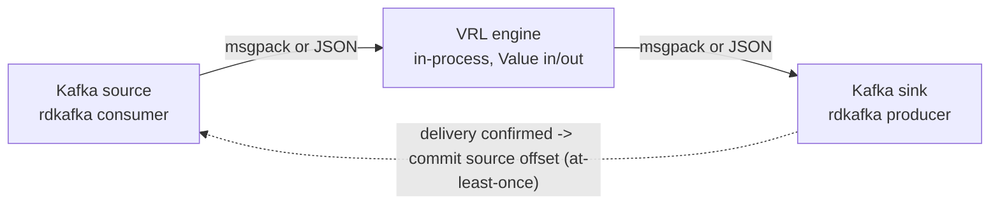

# dfe-transform-vrl

Embedded VRL (Vector Remap Language) transform engine with wrapper-controlled Kafka source/sink.

## Overview

dfe-transform-vrl is a Rust binary that runs VRL transforms on Kafka event streams.
It embeds the VRL crate directly, giving full control over memory, backpressure,
and wire format - without running Vector as a subprocess. It is built on the
[scalo](https://github.com/hyperi-io/scalo-rs) data-plane runtime (config cascade,
logging, metrics, Kafka transport, health probes, scaling).

**Why this exists (vs dfe-transform-vector):**

| Aspect | dfe-transform-vrl | dfe-transform-vector |
|--------|-------------------|---------------------|
| Transform engine | VRL crate (in-process) | Vector subprocess |
| Memory control | Bounded buffers | Vector unbounded |
| msgpack support | Native (zero conversion) | JSON pipe (2x conversion) |
| Supported transforms | VRL only | All Vector transforms |
| Container image | ~20 MiB | ~170 MiB |

Use **dfe-transform-vrl** for VRL-only transforms (the common case). Use
**dfe-transform-vector** when you need Vector-native transforms like `lua`,
`aggregate`, `dedupe`, or `throttle`.

## Quick Start

```bash
# Build
cargo build --release

# Run with config file
./target/release/dfe-transform-vrl --config config.yaml

# Run with environment overrides
DFE_TRANSFORM_SOURCE_BROKERS=kafka:9092 \
DFE_TRANSFORM_SOURCE_TOPICS=raw_events \
DFE_TRANSFORM_SINK_TOPIC=enriched_events \
  ./target/release/dfe-transform-vrl
```

## Configuration

See [config.example.yaml](config.example.yaml) for full configuration reference.

### Minimal Configuration

```yaml
pipeline:
  name: "my-pipeline"
  batch_size: 1000

source:
  brokers: ["kafka:9092"]
  topics: ["raw_events"]
  group_id: "dfe-transform-vrl-my-pipeline"

transforms:
  dir: "/etc/dfe/transforms/"

sink:
  brokers: ["kafka:9092"]
  topic: "enriched_events"
```

### VRL Transform Files

Transform files contain raw VRL source code. Files are loaded in sorted order
by filename and executed sequentially against each event:

```vrl
# transforms/01_parse.vrl
.parsed = parse_json!(.message)
del(.message)

# transforms/02_enrich.vrl
.environment = get_env_var("ENVIRONMENT") ?? "unknown"
.processed_at = now()
```

### Bundled Pipelines (opt-in)

`pipelines/filebeat/` ships a pre-canned, pure-VRL port of the DFE 2.1
filebeat-compat templates (Cisco Meraki / IOS / Umbrella) plus its
`timezones.csv` enrichment table. It is a convenience bundle, not engine
capability: opt in by pointing `transforms.dir` and `enrichment_tables` at
those files, exactly like any user-supplied transform.

**INTERIM:** elastic compatibility is being replaced by
`dfe-transform-elastic` (Rust-native, in beta). See
[pipelines/filebeat/README.md](pipelines/filebeat/README.md) for wiring,
routing behaviour, and known limitations.

### Environment Variable Overrides

All config fields have flat env var overrides for K8s big-dial configuration:

| Env Var | Config Field |
|---------|-------------|
| `DFE_TRANSFORM_PIPELINE_NAME` | `pipeline.name` |
| `DFE_TRANSFORM_SOURCE_BROKERS` | `source.brokers` |
| `DFE_TRANSFORM_SOURCE_TOPICS` | `source.topics` |
| `DFE_TRANSFORM_SOURCE_GROUP_ID` | `source.group_id` |
| `DFE_TRANSFORM_SINK_TOPIC` | `sink.topic` |
| `DFE_TRANSFORM_SINK_KEY_FIELD` | `sink.key_field` |
| `DFE_TRANSFORM_BATCH_SIZE` | `pipeline.batch_size` |

### Hot-Reload

Some configuration fields are hot-reloaded without pod restart:

| Hot-reloaded | Requires restart |
|-------------|-----------------|
| `pipeline.batch_size` | `source.*` (Kafka connections) |
| `pipeline.batch_timeout_ms` | `sink.brokers`, `sink.topic` |
| `sink.key_field` | `transforms.*` (compiled at startup) |
| `scaling.pressure_threshold` | `health.address`, `metrics.address` |

## API Endpoints

### GET /health/live

Kubernetes liveness probe. Returns `200 OK` when the process is running.

### GET /health/ready

Kubernetes readiness probe. Returns `503` if Kafka connections are unhealthy.

### GET /metrics

Prometheus metrics endpoint.

## Architecture



The wrapper owns both Kafka connections. Consumer offsets are committed only
after producer delivery confirmation (at-least-once guarantee).

## Development

```bash
# Run tests
cargo nextest run

# Run with debug logging
RUST_LOG=debug cargo run -- --config config.yaml

# Check config without running
cargo run -- config-check --config config.yaml
```

## Documentation

- [docs/DESIGN.md](docs/DESIGN.md) - Full architecture and design
- [config.example.yaml](config.example.yaml) - Configuration reference

## License

This project is licensed under the Business Source License 1.1 (BUSL-1.1).
See [LICENSE](LICENSE) for details.

Copyright (c) 2026 HYPERI PTY LIMITED

For commercial licensing options, see [COMMERCIAL.md](COMMERCIAL.md).
