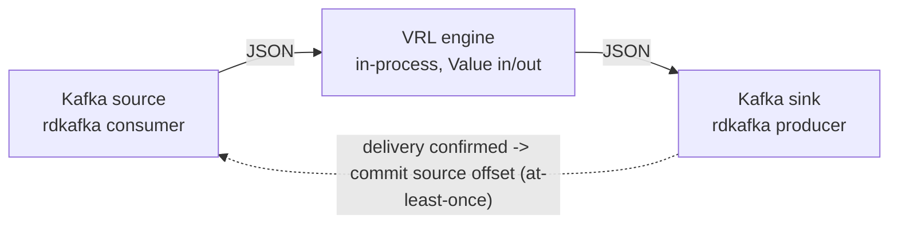

# dfe-transform-vrl

[](https://github.com/hyperi-io/dfe-transform-vrl/actions)
[](https://github.com/hyperi-io/dfe-transform-vrl/blob/main/LICENSE)

> Running Vector to reshape events costs you a subprocess, its config surface and
> its failure modes. This embeds the VRL engine instead, so the transform runs
> in-process and the wrapper owns memory, backpressure and offsets directly.

Embedded VRL (Vector Remap Language) transform engine with wrapper-controlled Kafka source/sink.

## Overview

dfe-transform-vrl is a Rust binary that runs VRL transforms on Kafka event streams.
It embeds the VRL crate directly, giving full control over memory, backpressure,
and wire format - without running Vector as a subprocess. It is built on the
[scalo](https://github.com/hyperi-io/scalo-rs) data-plane runtime (config cascade,
logging, metrics, Kafka transport, health probes, scaling).

**Why this exists (vs dfe-transform-vector):**

| Aspect | dfe-transform-vrl | dfe-transform-vector |
|--------|-------------------|---------------------|
| Transform engine | VRL crate (in-process) | Vector subprocess |
| Memory control | Bounded buffers | Vector unbounded |
| Supported transforms | VRL only | All Vector transforms |
| Container image | ~20 MiB | ~170 MiB |

Use **dfe-transform-vrl** for VRL-only transforms (the common case). Use
**dfe-transform-vector** when you need Vector-native transforms like `lua`,
`aggregate`, `dedupe`, or `throttle`.

## Quick Start

```bash
# Build
cargo build --release

# Run with config file
./target/release/dfe-transform-vrl --config config.yaml

# Run with environment overrides
DFE_TRANSFORM_SOURCE_BROKERS=kafka:9092 \
DFE_TRANSFORM_SOURCE_TOPICS=raw_events \
DFE_TRANSFORM_SINK_TOPIC=enriched_events \
  ./target/release/dfe-transform-vrl
```

## Configuration

See [config.example.yaml](https://github.com/hyperi-io/dfe-transform-vrl/blob/main/config.example.yaml) for full configuration reference.

### Minimal Configuration

```yaml
pipeline:
  name: "my-pipeline"
  batch_size: 1000

source:
  brokers: ["kafka:9092"]
  topics: ["raw_events"]
  group_id: "dfe-transform-vrl-my-pipeline"

transforms:
  dir: "/etc/dfe/transforms/"

sink:
  brokers: ["kafka:9092"]
  topic: "enriched_events"
```

### VRL Transform Files

Transform files contain raw VRL source code. Files are loaded in sorted order
by filename and executed sequentially against each event:

```vrl
# transforms/01_parse.vrl
.parsed = parse_json!(.message)
del(.message)

# transforms/02_enrich.vrl
.environment = get_env_var("ENVIRONMENT") ?? "unknown"
.processed_at = now()
```

### Bundled Pipelines (opt-in)

`pipelines/filebeat/` ships a pre-canned, pure-VRL port of the DFE 2.1
filebeat-compat templates (Cisco Meraki / IOS / Umbrella) plus its
`timezones.csv` enrichment table. It is a convenience bundle, not engine
capability: opt in by pointing `transforms.dir` and `enrichment_tables` at
those files, exactly like any user-supplied transform.

**INTERIM:** elastic compatibility is being replaced by
`dfe-transform-elastic` (Rust-native, in beta). See
[pipelines/filebeat/README.md](https://github.com/hyperi-io/dfe-transform-vrl/blob/main/pipelines/filebeat/README.md) for wiring,
routing behaviour, and known limitations.

### Environment Variable Overrides

The big dials have flat env var overrides for K8s. This is the whole list --
anything not here is not read:

| Env Var | Config Field |
|---------|-------------|
| `DFE_TRANSFORM_PIPELINE_NAME` | `pipeline.name` |
| `DFE_TRANSFORM_KAFKA_SASL_USERNAME` | `source.sasl.username` + `sink.sasl.username` |
| `DFE_TRANSFORM_KAFKA_SASL_PASSWORD` | `source.sasl.password` + `sink.sasl.password` |
| `DFE_TRANSFORM_KAFKA_SECURITY_PROTOCOL` | `source.tls.enabled` + `sink.tls.enabled`, set true when the value contains `SSL`, never set false |
| `DFE_TRANSFORM_SOURCE_BROKERS` | `source.brokers` |
| `DFE_TRANSFORM_SOURCE_TOPICS` | `source.topics` |
| `DFE_TRANSFORM_SOURCE_GROUP_ID` | `source.group_id` |
| `DFE_TRANSFORM_SOURCE_SASL_USERNAME` | `source.sasl.username` |
| `DFE_TRANSFORM_SOURCE_SASL_PASSWORD` | `source.sasl.password` |
| `DFE_TRANSFORM_SINK_BROKERS` | `sink.brokers` |
| `DFE_TRANSFORM_SINK_TOPIC` | `sink.topic` |
| `DFE_TRANSFORM_SINK_KEY_FIELD` | `sink.key_field` |
| `DFE_TRANSFORM_SINK_COMPRESSION` | `sink.compression` |
| `DFE_TRANSFORM_SINK_SASL_USERNAME` | `sink.sasl.username` |
| `DFE_TRANSFORM_SINK_SASL_PASSWORD` | `sink.sasl.password` |
| `DFE_TRANSFORM_TRANSFORMS_DIR` | `transforms.dir` |

The chart mounts the Kafka Secret's `username` and `password` into both the
`SOURCE_SASL_*` and the `SINK_SASL_*` pair, so one Secret serves both endpoints.
The shared `KAFKA_SASL_*` pair reaches both endpoints for a deployment outside
the chart, and the per-endpoint names override it.

Either half turns SASL on, an enabled block still missing one once the env
layer has run refuses to start, and the password is redacted on every output
path (`x-scalo-secret` + `writeOnly` in the emitted schema).

### Kafka over TLS with a private CA

`tls.ca_cert_file` is a path, and the chart mounts no certificate file. Put the
CA's PEM text in the rendered config instead:

```yaml
config:
  source:
    tls:
      enabled: true
    librdkafka_options:
      ssl.ca.pem: |
        -----BEGIN CERTIFICATE-----
        ...
        -----END CERTIFICATE-----
```

The same two keys go under `sink`. A CA is public, so a ConfigMap can hold it.
Mutual TLS is not supported through the chart, which mounts no client key. KEDA
scales on CPU and opens no Kafka connection, so it needs no CA.

### scalo's own settings share the config file

`metrics`, `logger`, `scaling`, `worker_pool`, `batch_processing`,
`self_regulation` and `version_check` are resolved by scalo, not by the wrapper.
scalo reads the file passed with `--config` as its settings layer, once at
startup, so those sections take effect from the mounted `config.yaml` beside the
wrapper's own:

```yaml
scaling:
  memory_gate_threshold: 0.8
batch_processing:
  max_chunk_size: 10000
```

A `config.yaml` picked up from the working directory with no `--config` is read
by the wrapper alone, so a scalo section in it changes nothing and the wrapper
warns at startup. Pass the file with `--config`.

The env layer outranks the file, and there the section nests on a **double**
underscore:

```bash
METRICS_ADDR=0.0.0.0:9090          # or DFE_TRANSFORM_METRICS__ADDRESS
LOG_LEVEL=debug                    # or DFE_TRANSFORM_LOGGER__LEVEL
LOG_FORMAT=json                    # or DFE_TRANSFORM_LOGGER__FORMAT
DFE_TRANSFORM_SCALING__MEMORY_GATE_THRESHOLD=0.8
DFE_TRANSFORM_BATCH_PROCESSING__MAX_CHUNK_SIZE=10000
```

A single underscore (`DFE_TRANSFORM_METRICS_ADDRESS`) produces a flat key that
matches no section and is ignored; that spelling also warns.

### Accepted but not applied

These parse, validate, and reach nothing. Setting one logs a warning at
startup naming the replacement. See `config::INERT_SETTINGS`.

| Setting | Why | Use instead |
|---------|-----|-------------|
| `pipeline.batch_size` | the batch engine is built by the scalo runtime before `run_service` | `batch_processing.max_chunk_size` |
| `pipeline.batch_timeout_ms` | the governed driver has no partial-batch timer | -- |
| `sink.key_field` | the producer's key argument carries the destination topic, not a partition key (scalo-rs#37) | -- |
| `source.commit_interval_ms` | auto-commit is off; the engine commits at the at-least-once barrier | -- |

`ConfigReloader` still re-reads and re-validates the file on a change or a
SIGHUP, so a bad edit is caught, but every field it carries is on that list --
no pipeline behaviour changes on reload today.

## API Endpoints

### GET /livez

Kubernetes liveness probe. Returns `200 OK` when the process is running.

### GET /readyz

Kubernetes readiness probe. Returns `503` if Kafka connections are unhealthy.

### GET /metrics

Prometheus metrics endpoint.

## Architecture



The wrapper owns both Kafka connections. Consumer offsets are committed only
after producer delivery confirmation (at-least-once guarantee).

JSON is the only payload format. MessagePack, supported in DFE/XDR 2.0 and 2.1, is deprecated in DFE 2.2 and no longer accepted: the JSON path (SIMD parsing with sonic-rs, zstd on the wire) is fast enough that MessagePack gave no CPU saving.

A record that is not JSON is dropped, counted in `records_error_total{stage="deserialise"}`, and its source is released `Dropped` so it is not redelivered.

## Development

```bash
# Run tests
cargo nextest run

# Run with debug logging
RUST_LOG=debug cargo run -- --config config.yaml

# Check config without running
cargo run -- config-check --config config.yaml
```

### Helm chart

No chart is committed here. At release, hyperi-ci runs the binary's `generate-artefacts` for the deployment contract and assembles a thin chart from it on the scalo-service library chart, at the version `release.helm.library` names in `.hyperi-ci.yaml`. Keep that version at the scalo version in `Cargo.toml`: a library renders only the contract version its scalo release writes.

To see the chart a release would ship, build the binary and run `hyperi-ci chart assemble --binary target/debug/dfe-transform-vrl --image ghcr.io/hyperi-io/dfe-transform-vrl:<tag>@sha256:<digest> --version <version>`. It prints the chart directory it wrote. `emit-chart` still writes scalo's full chart for local use.

The ScaledObject scales on CPU alone, because `contract()` sets `KafkaLagTrigger::disabled()`. Consumer-group lag rises when a downstream stage breaks, and more replicas cannot fix that. A deployment adds a trigger with the library's `keda.extraTriggers` value.

## Documentation

- [docs/architecture.md](https://github.com/hyperi-io/dfe-transform-vrl/blob/main/docs/architecture.md) - What the service is, why it is shaped that way, and the invariants
- [docs/DESIGN.md](https://github.com/hyperi-io/dfe-transform-vrl/blob/main/docs/DESIGN.md) - Deeper design detail: memory budget, reload matrix
- [config.example.yaml](https://github.com/hyperi-io/dfe-transform-vrl/blob/main/config.example.yaml) - Configuration reference

## License

This project is licensed under the Business Source License 1.1 (BUSL-1.1).
See [LICENSE](https://github.com/hyperi-io/dfe-transform-vrl/blob/main/LICENSE) for details.

Copyright (c) 2026 HYPERI PTY LIMITED

For commercial licensing options, see [COMMERCIAL.md](https://github.com/hyperi-io/dfe-transform-vrl/blob/main/COMMERCIAL.md).

## Context

### What this is

A single Rust binary that runs VRL transforms over records in the DFE data path
-- Kafka in and out on the `bus` transport, gRPC in and out on the `direct`
transport. Two boundaries get assumed wrongly. First, it is VRL only: a pipeline
needing `lua`, `aggregate`, `dedupe`, `throttle` or `sample` belongs in
dfe-transform-vector, which keeps the Vector subprocess and pays for it. Second,
this crate does not own its own event loop. scalo's `BatchEngine::pipeline`
drives `recv -> process -> send -> release`; this crate supplies the `process`
closure, the produce sink, the config, the VRL compiler and the enrichment
registry. Reading `src/pipeline.rs` expecting to find the loop is the usual wrong
turn.

### Where things live

| Path | Holds |
|---|---|
| `src/pipeline.rs` | The `process` closure and sink handed to scalo's batch engine |
| `src/engine/` | `compiler.rs` builds one program from the transform files, `runner.rs` runs it per event, `budget.rs` holds the compile memory floor |
| `src/config/` | `Config`, validation, `HotConfig`, `INERT_SETTINGS`, `SCALO_CASCADE_SECTIONS` |
| `src/enrichment/` | Table loading (CSV, JSON, YAML, MMDB, STIX, SQLite), refresh, the custom VRL functions |
| `src/deployment.rs` | `contract()` -- the single source the Dockerfile and the released chart are generated from |
| `Dockerfile` | Generator output, not hand-authored |
| `pipelines/filebeat/` | Opt-in data bundle (212,218 bytes of VRL plus a lookup table), not engine capability |
| `tests/` | `integration/` runs mostly without Kafka, `e2e/` needs a broker, `TESTING.md` explains the modes |
| `docs/architecture.md` | Why the service is shaped this way, and the invariants |

### Commands that prove a change

```bash
make check                                        # hyperi-ci check -- quality + test, the pre-push gate
cargo nextest run --features enrichment-mmdb,enrichment-sqlite  # what CI actually runs
cargo nextest run --all-features --run-ignored    # adds the broker-dependent e2e tests
cargo run -- config-check --config config.yaml    # validate a config without starting
cargo run --bin dfe-transform-vrl -- emit-dockerfile > Dockerfile    # regenerate the Dockerfile
```

Green lies here in three ways, and all three are on by default.

`default = []` in `Cargo.toml`, so a bare `cargo nextest run` does not compile the MMDB or SQLite enrichment tests in at all. `.hyperi-ci.yaml` adds `enrichment-mmdb` and `enrichment-sqlite` to both the test and the build feature sets -- the build too, because the Dockerfile only copies the binary, so a default build ships a container that rejects `type: mmdb` and `type: sqlite` tables at startup.

Kafka-dependent tests call `skip_if_no_kafka!()` and skip cleanly when no broker
is reachable. They report as not-failed, which is not the same as proven.

The e2e tests are `#[ignore]` and need `--run-ignored` plus a broker. Set
`TEST_MODE=docker` for the dfe-docker infra profile on `localhost:19092`, or
`TEST_MODE=remote` for the cluster endpoints.

One more: the push trigger in `.github/workflows/ci.yml` carries
`paths-ignore: docs/**, **.md`, so a docs-only push runs no jobs. The
`pull_request` trigger has no such filter, so the PR is where a docs change gets
checked.

### What tends to bite

| Don't | Do | Why |
|---|---|---|
| Hand-edit `Dockerfile`, or commit a chart | Fix `src/deployment.rs::contract()` and regenerate | The Dockerfile is generator output and the release assembles the chart from the contract, so a hand edit is reverted or never ships. A chart once mounted the Kafka SASL Secret into env names nothing read, so credentials reached the pod and were ignored -- `test_every_contract_secret_env_var_reaches_the_config` now holds every declared name to the field it spells |
| Bump scalo and leave `release.helm.library` behind | Move `release.helm.library` in `.hyperi-ci.yaml` to the same scalo version | A scalo-service release renders only the contract version its scalo release writes |
| Turn the Kafka lag trigger back on in `contract()` | Leave `KafkaLagTrigger::disabled()` and scale on CPU plus scaling pressure | Lag rises when a downstream stage breaks, so a lag trigger adds pods that wait on the same broken stage. The lag trigger was also the one that kept reading a kafka block this app's values do not have, fixed three times (#37, #65, #70) |
| Put a scalo section (`metrics`, `logger`, `scaling`, `worker_pool`, `batch_processing`, `self_regulation`, `version_check`) in a `config.yaml` the binary finds in its working directory | Pass the file with `--config`, or set the section through the env layer on a **double** underscore | scalo reads the `--config` file as its settings layer but finds other files only by fixed base name (`settings.yaml`, `defaults.yaml`), so a working-directory `config.yaml` reaches the wrapper alone. Full list above under Configuration |
| Trust `pipeline.batch_size`, `pipeline.batch_timeout_ms`, `sink.key_field` or `source.commit_interval_ms` | Size a chunk with `batch_processing.max_chunk_size` | `config::INERT_SETTINGS` -- accepted, validated, reaching nothing. Table above under Configuration |
| Call a bare `cargo nextest run` green | Pass `--features enrichment-mmdb,enrichment-sqlite` | `default = []`, so the MMDB and SQLite tests are not compiled in and the run is green without having tested them |
| Set `sasl.enabled` with an empty username or password | Supply both, or neither | librdkafka's SCRAM check is a NULL check that an empty string passes, so that pod authenticated against nothing and still reported Ready. Refused at startup now |
| Add a serialise path that redacts by field name | Keep the password a `scalo::SensitiveString` | Redaction is by type on every path -- `Debug`, the `/config` dump, the emitted schema. The figment round-trip has to be wrapped in `expose_during` or a file-sourced password reaches the broker as the literal `***REDACTED***` |
| Size the container from steady state when the program is large | Leave headroom for the compile | Compilation scales with the VRL, and the bundled filebeat program is OOM-killed under a 32 MiB limit. Below the floor the kernel kills the process mid-compile, seen as an exit-137 restart loop with nothing in the log. `engine::budget` refuses first and names all three numbers |
| Pick the optimisation tier with `publish-target` | Use `build.skip_optimize` in `.hyperi-ci.yaml`, or the `skip-optimize` dispatch input for one run | hyperi-ci ignores `publish-target`. A build that ships gets PGO and BOLT from `scripts/pgo-workload.sh` unless optimisation is skipped, and a stable release that skips it is refused unless the dispatch passes `release-unoptimized: true` |

### Where this sits

Inbound -- what this repo depends on:

- **scalo-rs** (`cargo-dep`). `Cargo.toml` declares the `scalo` crate by range, a
  second range covering the dev dependency. A scalo release arrives through that
  range: `cargo update -p scalo` and rebuild if it admits the version, widen the
  range first if not.
- **scalo-rs** (`generated-file`, lockstep). The `Dockerfile` is written by
  scalo's generator from this crate's `deployment::contract()`, at contract
  schema version 4. A generator or schema change upstream means regenerating
  with the command in the file's own header and committing the diff. The
  released chart is assembled on the scalo-service library chart at
  `release.helm.library`, which moves with the scalo version in `Cargo.toml`.
- **dfe-infra** (`apps.yaml`, deploy-time authority). The suite manifest declares
  what this app is: `multiplicity: per_config` (one deployment per source config,
  never a singleton), `scale_deployed: true`, both transports, and a source
  binding deriving `{source}_land` in, `{source}_load` out and
  `dfe-transform-vrl-{source}` as the consumer group. Adding a source is a
  manifest edit, not a change here.

Outbound -- what depends on this repo:

- **dfe-infra** (`image-pin`, lockstep). Pins this repo's ghcr image as a tag plus
  the digest that makes it immutable. A release here means bumping the tag and
  re-resolving the digest there, with `check_versions_drift.py` confirming the
  chart's appVersion and the digest mirror agree.

dfe-transform-splack runs this repo's engine image with a rule-config chart of
its own. It is out of suite scope and no work here is driven by it.
