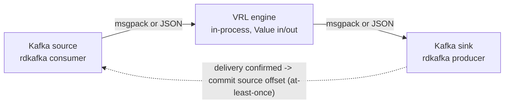

# dfe-transform-vrl

[](https://github.com/hyperi-io/dfe-transform-vrl/actions)
[](https://github.com/hyperi-io/dfe-transform-vrl/blob/main/LICENSE)

> Running Vector to reshape events costs you a subprocess, its config surface and
> its failure modes. This embeds the VRL engine instead, so the transform runs
> in-process and the wrapper owns memory, backpressure and offsets directly.

Embedded VRL (Vector Remap Language) transform engine with wrapper-controlled Kafka source/sink.

## Overview

dfe-transform-vrl is a Rust binary that runs VRL transforms on Kafka event streams.
It embeds the VRL crate directly, giving full control over memory, backpressure,
and wire format - without running Vector as a subprocess. It is built on the
[scalo](https://github.com/hyperi-io/scalo-rs) data-plane runtime (config cascade,
logging, metrics, Kafka transport, health probes, scaling).

**Why this exists (vs dfe-transform-vector):**

| Aspect | dfe-transform-vrl | dfe-transform-vector |
|--------|-------------------|---------------------|
| Transform engine | VRL crate (in-process) | Vector subprocess |
| Memory control | Bounded buffers | Vector unbounded |
| msgpack support | Native (zero conversion) | JSON pipe (2x conversion) |
| Supported transforms | VRL only | All Vector transforms |
| Container image | ~20 MiB | ~170 MiB |

Use **dfe-transform-vrl** for VRL-only transforms (the common case). Use
**dfe-transform-vector** when you need Vector-native transforms like `lua`,
`aggregate`, `dedupe`, or `throttle`.

## Quick Start

```bash
# Build
cargo build --release

# Run with config file
./target/release/dfe-transform-vrl --config config.yaml

# Run with environment overrides
DFE_TRANSFORM_SOURCE_BROKERS=kafka:9092 \
DFE_TRANSFORM_SOURCE_TOPICS=raw_events \
DFE_TRANSFORM_SINK_TOPIC=enriched_events \
  ./target/release/dfe-transform-vrl
```

## Configuration

See [config.example.yaml](https://github.com/hyperi-io/dfe-transform-vrl/blob/main/config.example.yaml) for full configuration reference.

### Minimal Configuration

```yaml
pipeline:
  name: "my-pipeline"
  batch_size: 1000

source:
  brokers: ["kafka:9092"]
  topics: ["raw_events"]
  group_id: "dfe-transform-vrl-my-pipeline"

transforms:
  dir: "/etc/dfe/transforms/"

sink:
  brokers: ["kafka:9092"]
  topic: "enriched_events"
```

### VRL Transform Files

Transform files contain raw VRL source code. Files are loaded in sorted order
by filename and executed sequentially against each event:

```vrl
# transforms/01_parse.vrl
.parsed = parse_json!(.message)
del(.message)

# transforms/02_enrich.vrl
.environment = get_env_var("ENVIRONMENT") ?? "unknown"
.processed_at = now()
```

### Bundled Pipelines (opt-in)

`pipelines/filebeat/` ships a pre-canned, pure-VRL port of the DFE 2.1
filebeat-compat templates (Cisco Meraki / IOS / Umbrella) plus its
`timezones.csv` enrichment table. It is a convenience bundle, not engine
capability: opt in by pointing `transforms.dir` and `enrichment_tables` at
those files, exactly like any user-supplied transform.

**INTERIM:** elastic compatibility is being replaced by
`dfe-transform-elastic` (Rust-native, in beta). See
[pipelines/filebeat/README.md](https://github.com/hyperi-io/dfe-transform-vrl/blob/main/pipelines/filebeat/README.md) for wiring,
routing behaviour, and known limitations.

### Environment Variable Overrides

The big dials have flat env var overrides for K8s. This is the whole list --
anything not here is not read:

| Env Var | Config Field |
|---------|-------------|
| `DFE_TRANSFORM_PIPELINE_NAME` | `pipeline.name` |
| `DFE_TRANSFORM_KAFKA_SASL_USERNAME` | `source.sasl.username` + `sink.sasl.username` |
| `DFE_TRANSFORM_KAFKA_SASL_PASSWORD` | `source.sasl.password` + `sink.sasl.password` |
| `DFE_TRANSFORM_SOURCE_BROKERS` | `source.brokers` |
| `DFE_TRANSFORM_SOURCE_TOPICS` | `source.topics` |
| `DFE_TRANSFORM_SOURCE_GROUP_ID` | `source.group_id` |
| `DFE_TRANSFORM_SOURCE_FORMAT` | `source.format` |
| `DFE_TRANSFORM_SOURCE_SASL_USERNAME` | `source.sasl.username` |
| `DFE_TRANSFORM_SOURCE_SASL_PASSWORD` | `source.sasl.password` |
| `DFE_TRANSFORM_SINK_BROKERS` | `sink.brokers` |
| `DFE_TRANSFORM_SINK_TOPIC` | `sink.topic` |
| `DFE_TRANSFORM_SINK_KEY_FIELD` | `sink.key_field` |
| `DFE_TRANSFORM_SINK_COMPRESSION` | `sink.compression` |
| `DFE_TRANSFORM_SINK_SASL_USERNAME` | `sink.sasl.username` |
| `DFE_TRANSFORM_SINK_SASL_PASSWORD` | `sink.sasl.password` |
| `DFE_TRANSFORM_TRANSFORMS_DIR` | `transforms.dir` |

The chart mounts the Kafka Secret into the `KAFKA_SASL_*` pair, which reaches
both endpoints and beats whatever the config file set for either. The
`SOURCE_`/`SINK_` names override it back, per endpoint -- but `chart/` injects
only the shared pair, so a two-cluster deployment has to add them to the chart.

Either half turns SASL on, an enabled block still missing one once the env
layer has run refuses to start, and the password is redacted on every output
path (`x-dfe-secret` + `writeOnly` in the emitted schema).

### scalo's own settings are not in the config file

`metrics`, `logger`, `scaling`, `worker_pool`, `batch_processing`,
`self_regulation` and `version_check` are resolved by scalo, from a cascade
that discovers files by fixed base name (`settings.yaml`, `defaults.yaml`) and
therefore never reads the mounted `config.yaml`. Writing one of those sections
into that file parses cleanly and changes nothing; the wrapper warns at startup
when it finds one. Set them through the env layer, where the section nests on a
**double** underscore:

```bash
METRICS_ADDR=0.0.0.0:9090          # or DFE_TRANSFORM_METRICS__ADDRESS
LOG_LEVEL=debug                    # or DFE_TRANSFORM_LOGGER__LEVEL
LOG_FORMAT=json                    # or DFE_TRANSFORM_LOGGER__FORMAT
DFE_TRANSFORM_SCALING__MEMORY_GATE_THRESHOLD=0.8
DFE_TRANSFORM_BATCH_PROCESSING__MAX_CHUNK_SIZE=10000
```

A single underscore (`DFE_TRANSFORM_METRICS_ADDRESS`) produces a flat key that
matches no section and is ignored; that spelling also warns.

### Accepted but not applied

These parse, validate, and reach nothing. Setting one logs a warning at
startup naming the replacement. See `config::INERT_SETTINGS`.

| Setting | Why | Use instead |
|---------|-----|-------------|
| `pipeline.batch_size` | the batch engine is built by the scalo runtime before `run_service` | `batch_processing.max_chunk_size` |
| `pipeline.batch_timeout_ms` | the governed driver has no partial-batch timer | -- |
| `sink.key_field` | the producer's key argument carries the destination topic, not a partition key (scalo-rs#37) | -- |
| `source.commit_interval_ms` | auto-commit is off; the engine commits at the at-least-once barrier | -- |

`ConfigReloader` still re-reads and re-validates the file on a change or a
SIGHUP, so a bad edit is caught, but every field it carries is on that list --
no pipeline behaviour changes on reload today.

## API Endpoints

### GET /livez

Kubernetes liveness probe. Returns `200 OK` when the process is running.

### GET /readyz

Kubernetes readiness probe. Returns `503` if Kafka connections are unhealthy.

### GET /metrics

Prometheus metrics endpoint.

## Architecture



The wrapper owns both Kafka connections. Consumer offsets are committed only
after producer delivery confirmation (at-least-once guarantee).

## Development

```bash
# Run tests
cargo nextest run

# Run with debug logging
RUST_LOG=debug cargo run -- --config config.yaml

# Check config without running
cargo run -- config-check --config config.yaml
```

### Helm chart

`chart/` is generated. `cargo run --bin dfe-transform-vrl -- emit-chart chart`
rewrites it from `src/deployment.rs::contract()`, so a hand edit under `chart/`
is reverted the next time anyone regenerates. Fix the contract, not the output.

One file is a deliberate exception. `chart/templates/keda-scaledobject.yaml` is
hand-fixed: the generator emits `.Values.config.kafka.*`, this app's values have
`config.source` and `config.sink` and no `config.kafka` block, so a regenerated
copy fails to render at all with `nil pointer evaluating interface {}.brokers`.
Re-apply that one diff after every `emit-chart`, until the generator is fixed
upstream in scalo.

`test_committed_chart_matches_the_generator` holds both halves of that: it fails
if any other chart file drifts from `emit-chart`, and fails the other way if the
KEDA file stops diverging, so the exception cannot outlive the generator bug.

## Documentation

- [docs/architecture.md](https://github.com/hyperi-io/dfe-transform-vrl/blob/main/docs/architecture.md) - What the service is, why it is shaped that way, and the invariants
- [docs/DESIGN.md](https://github.com/hyperi-io/dfe-transform-vrl/blob/main/docs/DESIGN.md) - Deeper design detail: format detection, memory budget, reload matrix
- [config.example.yaml](https://github.com/hyperi-io/dfe-transform-vrl/blob/main/config.example.yaml) - Configuration reference

## License

This project is licensed under the Business Source License 1.1 (BUSL-1.1).
See [LICENSE](https://github.com/hyperi-io/dfe-transform-vrl/blob/main/LICENSE) for details.

Copyright (c) 2026 HYPERI PTY LIMITED

For commercial licensing options, see [COMMERCIAL.md](https://github.com/hyperi-io/dfe-transform-vrl/blob/main/COMMERCIAL.md).

## Context

### What this is

A single Rust binary that runs VRL transforms over records in the DFE data path
-- Kafka in and out on the `bus` transport, gRPC in and out on the `direct`
transport. Two boundaries get assumed wrongly. First, it is VRL only: a pipeline
needing `lua`, `aggregate`, `dedupe`, `throttle` or `sample` belongs in
dfe-transform-vector, which keeps the Vector subprocess and pays for it. Second,
this crate does not own its own event loop. scalo's `BatchEngine::run_governed`
drives `recv -> process -> send -> commit`; this crate supplies the `process`
closure, the produce sink, the config, the VRL compiler and the enrichment
registry. Reading `src/pipeline.rs` expecting to find the loop is the usual wrong
turn.

### Where things live

| Path | Holds |
|---|---|
| `src/pipeline.rs` | The `process` closure and sink handed to scalo's batch engine |
| `src/engine/` | `compiler.rs` builds one program from the transform files, `runner.rs` runs it per event, `budget.rs` holds the compile memory floor |
| `src/config/` | `Config`, validation, `HotConfig`, `INERT_SETTINGS`, `SCALO_CASCADE_SECTIONS` |
| `src/enrichment/` | Table loading (CSV, JSON, YAML, MMDB, STIX, SQLite), refresh, the custom VRL functions |
| `src/deployment.rs` | `contract()` -- the single source the Dockerfile and `chart/` are generated from |
| `chart/`, `Dockerfile` | Generator output, not hand-authored |
| `pipelines/filebeat/` | Opt-in data bundle (212,218 bytes of VRL plus a lookup table), not engine capability |
| `tests/` | `integration/` runs mostly without Kafka, `e2e/` needs a broker, `TESTING.md` explains the modes |
| `docs/architecture.md` | Why the service is shaped this way, and the invariants |

### Commands that prove a change

```bash
make check                                        # hyperi-ci check -- quality + test, the pre-push gate
cargo nextest run --features enrichment-mmdb      # what CI actually runs
cargo nextest run --all-features --run-ignored    # adds the broker-dependent e2e tests
cargo run -- config-check --config config.yaml    # validate a config without starting
cargo run --bin dfe-transform-vrl -- emit-chart chart    # regenerate the chart
```

Green lies here in three ways, and all three are on by default.

`default = []` in `Cargo.toml`, so a bare `cargo nextest run` does not compile the
MMDB enrichment tests in at all. `.hyperi-ci.yaml` adds `enrichment-mmdb` to both
the test and the build feature sets -- the build too, because the Dockerfile only
copies the binary, so a default build ships a container that rejects
`type: mmdb` tables at startup.

Kafka-dependent tests call `skip_if_no_kafka!()` and skip cleanly when no broker
is reachable. They report as not-failed, which is not the same as proven.

The e2e tests are `#[ignore]` and need `--run-ignored` plus a broker. Set
`TEST_MODE=docker` for the dfe-docker infra profile on `localhost:19092`, or
`TEST_MODE=remote` for the cluster endpoints.

One more: the push trigger in `.github/workflows/ci.yml` carries
`paths-ignore: docs/**, **.md`, so a docs-only push runs no jobs. The
`pull_request` trigger has no such filter, so the PR is where a docs change gets
checked.

### What tends to bite

| Don't | Do | Why |
|---|---|---|
| Hand-edit `chart/` or `Dockerfile` | Fix `src/deployment.rs::contract()` and regenerate | Both are generator output and a hand edit is reverted by the next regeneration. The chart once mounted the Kafka SASL Secret into env names nothing read, so credentials reached the pod and were ignored -- fixed in the generator so `emit-chart` keeps it |
| Regenerate the chart and commit it blind | Re-apply the `keda-scaledobject.yaml` hand fix | The generator emits `.Values.config.kafka.*`, this app's values carry `config.source` and `config.sink` and no `config.kafka`, so a regenerated copy fails to render at all with `nil pointer evaluating interface {}.brokers`. The KEDA scaler reading a kafka block it does not have was fixed three times (#37, #65, #70) |
| Put a scalo section (`metrics`, `logger`, `scaling`, `worker_pool`, `batch_processing`, `self_regulation`, `version_check`) in the config file | Set it through the env layer, on a **double** underscore | scalo's cascade finds files by fixed base name and can never be pointed at `config.yaml`, so the section parses and reaches nothing. Full list above under Configuration |
| Trust `pipeline.batch_size`, `pipeline.batch_timeout_ms`, `sink.key_field` or `source.commit_interval_ms` | Size a chunk with `batch_processing.max_chunk_size` | `config::INERT_SETTINGS` -- accepted, validated, reaching nothing. Table above under Configuration |
| Call a bare `cargo nextest run` green | Pass `--features enrichment-mmdb` | `default = []`, so the MMDB tests are not compiled in and the run is green without having tested them |
| Set `sasl.enabled` with an empty username or password | Supply both, or neither | librdkafka's SCRAM check is a NULL check that an empty string passes, so that pod authenticated against nothing and still reported Ready. Refused at startup now |
| Add a serialise path that redacts by field name | Keep the password a `scalo::SensitiveString` | Redaction is by type on every path -- `Debug`, the `/config` dump, the emitted schema. The figment round-trip has to be wrapped in `expose_during` or a file-sourced password reaches the broker as the literal `***REDACTED***` |
| Size the container from steady state when the program is large | Leave headroom for the compile | Compilation scales with the VRL, and the bundled filebeat program is OOM-killed under a 32 MiB limit. Below the floor the kernel kills the process mid-compile, seen as an exit-137 restart loop with nothing in the log. `engine::budget` refuses first and names all three numbers |
| Change `publish-target` to `internal` in the CI workflow | Leave it `both` | `internal` resolves to the spike channel, which is Tier 1 only -- a silent demotion that drops PGO and BOLT from the release build. dfe-loader v1.17.4 shipped that way before flipping back |

### Where this sits

Inbound -- what this repo depends on:

- **scalo-rs** (`cargo-dep`). `Cargo.toml` declares the `scalo` crate by range, a
  second range covering the dev dependency. A scalo release arrives through that
  range: `cargo update -p scalo` and rebuild if it admits the version, widen the
  range first if not.
- **scalo-rs** (`generated-file`, lockstep). The `Dockerfile` and everything under
  `chart/` are written by scalo's generators from this crate's
  `deployment::contract()`. A generator or schema change upstream means
  regenerating with the command in the file's own header and committing the diff.
- **dfe-infra** (`apps.yaml`, deploy-time authority). The suite manifest declares
  what this app is: `multiplicity: per_config` (one deployment per source config,
  never a singleton), `scale_deployed: true`, both transports, and a source
  binding deriving `{source}_land` in, `{source}_load` out and
  `dfe-transform-vrl-{source}` as the consumer group. Adding a source is a
  manifest edit, not a change here.

Outbound -- what depends on this repo:

- **dfe-infra** (`image-pin`, lockstep). Pins this repo's ghcr image as a tag plus
  the digest that makes it immutable. A release here means bumping the tag and
  re-resolving the digest there, with `check_versions_drift.py` confirming the
  chart's appVersion and the digest mirror agree.

The released artefact and `main` have diverged. `v1.1.24` (2026-09-16) is the
latest release, and `origin/main` carries four `fix:` commits past it -- #65,
#68, #69 and #70, covering the KEDA ScaledObject rendering and trigger auth, the
metrics manifest and a rustls patch, and the memory gauges. Anything pinning
`v1.1.24` does not have them.

dfe-transform-splack runs this repo's engine image with a rule-config chart of
its own. It is out of suite scope and no work here is driven by it.
