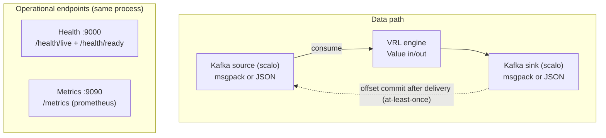

# dfe-transform-vrl — Design Document

## Overview

`dfe-transform-vrl` is an embedded VRL transform engine for Kafka-to-Kafka
pipelines. Unlike `dfe-transform-vector` (which runs Vector as a subprocess),
this service embeds the VRL crate directly and owns the Kafka consumer/producer,
giving full control over memory, backpressure, and wire format.

## Problem Statement

### Memory Control

Vector.dev has no configurable memory cap. Its internal buffers grow unbounded
based on throughput. In K8s autoscaling, pod memory limits must be set to the
maximum Vector might ever use, resulting in 2-4x memory waste compared to DFE
services that control their own buffers.

### Wire Format

The DFE platform uses MessagePack as its primary wire format (with JSON
fallback and auto-sensing). Vector has no msgpack codec support. Using Vector
for msgpack pipelines requires format conversion (msgpack→JSON→VRL→JSON→msgpack),
negating the CPU and memory benefits of msgpack.

## Architecture



## Data Flow

### Per-Event Processing

```
Kafka partition message (raw bytes)
  │
  ├─ FormatDetector: auto-sense msgpack vs JSON (first message locks format)
  │
  ├─ Deserialise: rmp_serde::from_slice::<Value>() or serde_json::from_slice::<Value>()
  │
  ├─ Run VRL program(s) on Value
  │   └─ VRL operates directly on Value — no format conversion
  │
  ├─ Serialise: rmp_serde::to_vec(&value) or serde_json::to_vec(&value)
  │
  └─ KafkaTransport::send() (scalo) → delivery future
```

### Offset Commit Strategy (At-Least-Once)

Consumer offsets are committed only after producer delivery confirmation:

1. Consumer fetches batch of messages from partition P
2. Each message is transformed and sent to producer
3. Producer delivery callbacks confirm writes to sink topic
4. Track highest contiguous confirmed offset per partition
5. Commit confirmed offsets to consumer group

If the process crashes before commit, messages are re-consumed and re-processed
(at-least-once, not exactly-once). VRL transforms should be idempotent.

### Format Detection

Uses `scalo::transport::FormatDetector`:

- Auto-sense mode (default): first message on a partition locks the format
- Force mode: explicit msgpack or JSON only
- Mismatch threshold: after 10 consecutive mismatches, format auto-resets
- Per-partition detection: different partitions may use different formats

## VRL Integration

### Compilation

VRL programs are compiled once at startup:

```rust
let program = vrl::compiler::compile(source, &vrl::stdlib::all())
    .map_err(|diagnostics| /* format errors */)?;
```

The compiled `Program` is reused for every event — zero per-event compilation cost.

### Execution

Each event is wrapped in a `TargetValueRef` and passed to the VRL runtime:

```rust
let mut target = TargetValueRef {
    value: &mut event_value,
    metadata: &mut metadata,
    secrets: &mut secrets,
};
runtime.resolve(&mut target, &program)?;
```

VRL's `Value` type is serde-compatible, meaning `rmp_serde` can deserialise
msgpack bytes directly into it. No intermediate JSON representation needed.

### Transform File Format

Transform files contain raw VRL source code (not Vector YAML):

```vrl
# transforms/01_parse.vrl
.parsed = parse_json!(.message)
del(.message)

# transforms/02_enrich.vrl
.environment = get_env_var("ENVIRONMENT") ?? "unknown"
.processed_at = now()
```

Files are loaded in sorted order (by filename) and concatenated into a single
VRL program. This matches Vector's remap transform behaviour where multiple
VRL statements execute sequentially.

### Bundled Pipeline: filebeat-compat (INTERIM)

`pipelines/filebeat/` ships a pre-canned, opt-in port of the DFE 2.1 Vector
filebeat templates (Cisco Meraki logs, Cisco IOS, Cisco Umbrella) as one
pure-VRL file plus its `timezones.csv` enrichment table. It is convenience
data, not engine capability: opting in means pointing the standard
`transforms.dir` and `enrichment_tables` config at those files. The engine
carries no filebeat-specific code; the integration tests
(`tests/integration/filebeat_pipeline.rs`) drive the bundle with the real
elastic/integrations pipeline test corpus, which doubles as a full-engine
workload.

INTERIM: elastic compatibility is being replaced by `dfe-transform-elastic`
(Rust-native, in beta). Wiring, routing behaviour, known limitations, and
regeneration tooling (`scripts/filebeat/`) are documented in
[pipelines/filebeat/README.md](../pipelines/filebeat/README.md).

## Memory Budget

The wrapper controls all memory allocation:

| Component | Configuration | Default |
|-----------|--------------|---------|
| Consumer prefetch | `source.max_buffer_bytes` | 64 MiB |
| Transform batch | `pipeline.batch_size` | 1000 events |
| Producer queue | `sink.max_buffer_bytes` | 64 MiB |
| Total pod memory | K8s resource limit | 256 MiB |

The sum of consumer + producer buffers must fit within the pod memory limit
minus overhead (binary, runtime, VRL compiled programs). The wrapper enforces
backpressure: if the producer queue is full, the consumer pauses fetching.

## Configuration

Same big-dial pattern as `dfe-transform-vector`, minus Vector subprocess config:

```yaml
pipeline:
  name: "my-pipeline"
  batch_size: 1000                  # events per transform batch
  batch_timeout_ms: 100             # max wait for full batch

source:
  brokers: ["kafka:9092"]
  topics: ["raw_events"]
  group_id: "dfe-transform-vrl-my-pipeline"
  format: "auto"                    # auto, json, msgpack
  max_buffer_bytes: 67108864        # 64 MiB consumer buffer

transforms:
  dir: "/etc/dfe-transform-vrl/transforms/"       # directory of .vrl files

sink:
  brokers: ["kafka:9092"]
  topic: "enriched_events"
  key_field: ".org_id"
  max_buffer_bytes: 67108864        # 64 MiB producer buffer

health:
  address: "0.0.0.0:9000"

metrics:
  address: "0.0.0.0:9090"
```

## Comparison: dfe-transform-vrl vs dfe-transform-vector

| Aspect | dfe-transform-vrl | dfe-transform-vector |
|--------|-------------------|---------------------|
| Transform engine | VRL crate (in-process) | Vector subprocess |
| Kafka source/sink | rdkafka (wrapper-controlled) | Vector-managed |
| Memory control | Full (bounded buffers) | None (Vector unbounded) |
| msgpack support | Native (zero conversion) | JSON pipe (2x conversion) |
| Supported transforms | VRL only | All Vector transforms |
| Container image size | ~20 MiB (Rust binary) | ~170 MiB (Rust + Vector) |
| Process model | Single process | Wrapper + subprocess |
| Startup time | Fast (compile VRL) | Slower (spawn + healthcheck Vector) |
| Crash recovery | Restart binary | Restart subprocess + binary |

### When to Use Which

- **dfe-transform-vrl**: VRL-only transforms (the common case), msgpack pipelines,
  memory-constrained pods, high-density deployments
- **dfe-transform-vector**: Pipelines needing Vector-native transforms (`lua`,
  `aggregate`, `dedupe`, `throttle`, `sample`), or complex multi-source/sink routing

## Hot-Reload

Configuration changes are split into two categories:

### Hot-reloaded (takes effect on next batch)

These fields are read from `SharedConfig<HotConfig>` at the start of each batch
iteration. Changes propagate via scalo's `ConfigReloader` (file polling + SIGHUP).

| Field | What it controls |
|-------|-----------------|
| `pipeline.batch_size` | Events per transform batch |
| `pipeline.batch_timeout_ms` | Max wait before flushing partial batch |
| `sink.key_field` | Kafka partition key path (e.g. `.org_id`) |
| `scaling.pressure_threshold` | KEDA scaling pressure threshold |

### Requires pod restart

These fields are bound to connections, compiled programs, or server sockets
established at startup. Changing them requires a pod restart (which is the
standard K8s pattern — ConfigMap changes trigger rolling restart via the
`checksum/config` annotation in the Deployment template).

| Field | Why |
|-------|-----|
| `pipeline.name` | Baked into Kafka group_id, metrics labels, tracing spans |
| `source.*` | rdkafka consumer: connection, subscription, auth, TLS, buffers |
| `sink.brokers` | rdkafka producer connection |
| `sink.topic` | Output topic (changing mid-stream risks data loss) |
| `sink.compression` | rdkafka `compression.type` |
| `sink.sasl.*` / `sink.tls.*` | Security protocol |
| `sink.max_buffer_bytes` | rdkafka `queue.buffering.max.kbytes` |
| `sink.librdkafka_options` | librdkafka `ClientConfig` |
| `transforms.*` | VRL programs compiled at startup |
| `health.address` | HTTP server socket bind |
| `metrics.address` | Metrics server socket bind |
| `logging.*` | Tracing subscriber |
