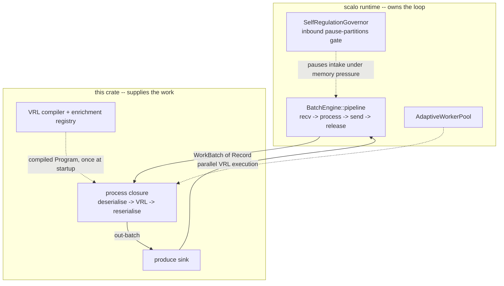

# Architecture

## The problem this shape solves

Reshaping events with Vector costs memory DFE cannot afford at volume.

Vector has no configurable memory cap. Its internal buffers grow with
throughput, so a Kubernetes memory limit has to be sized for the worst case
Vector might ever reach rather than the work actually queued.

That cost buys access to Vector's non-VRL transforms, which most pipelines never
use. So the shape is: keep VRL, drop Vector. Compile the VRL crate into the
binary, and let the wrapper own the buffers and the wire format.

### What it is, and what it is not

One Rust binary. It reads records, runs a compiled VRL program over each one,
and writes the results out. Kafka in and out on the `bus` transport, gRPC in and
out on the `direct` transport (`0.0.0.0:6000` listener, default sink endpoint
`http://dfe-loader:6000`).

It is not a general transform host. VRL only. A pipeline needing a
Vector-native transform -- `lua`, `aggregate`, `dedupe`, `throttle`, `sample` --
belongs in dfe-transform-vector, which keeps the subprocess and pays for it.

It is also not the owner of its own event loop, which is the part that surprises
readers.

## Who owns the loop

The binary is a thin VRL-specific layer over scalo's data-plane runtime. scalo's
`BatchEngine::pipeline` drives `recv -> process -> send -> release`, including
the held source acknowledgement and self-regulation. This crate supplies only the
`process` closure and the produce sink, plus the config, the VRL compiler and the
enrichment registry.

Per block of records:

1. The loop receives a `WorkBatch` from the source. On the bus transport that
   is the governed Kafka consumer: the inbound brake is attached, so intake
   pauses under memory pressure by pausing partitions -- the member stays in
   the consumer group and no rebalance fires. On the direct transport it is the
   Push listener, which refuses pushes `UNAVAILABLE` under the same pressure.
2. `process` deserialises each record into a VRL `Value` (format auto-sensed),
   runs the compiled program on the worker pool in parallel, and reserialises
   survivors back to the format they arrived in.
3. The loop sends the whole out-batch through `TransportSender::send_batch`.
4. The loop releases the block's source only after the send returns `Ok`:
   Kafka commits the offsets, the Push listener answers its sender OK.

## Invariants: the delivery contract

These are the rules a reader cannot recover by skimming the code, and each one
is why some part of the code looks the way it does.

**At-least-once is batch-level, not per record.** The source is released after
the batch send succeeds. A crash between send and release re-delivers the whole
block, so **VRL programs must be idempotent**. There is no exactly-once path and
no per-record commit to fall back on.

**A Push is answered only once its records are delivered.** The listener is built armed, so a sender waits for a Kafka delivery report or the next hop's own answer. A failed or refused send is retried until the hold runs out (at most 18 s, less under a shorter sender deadline), then answered `UNAVAILABLE`. The next hop gets 15 s inside that hold: the gRPC sink's deadline, or Kafka's `message.timeout.ms` unless `librdkafka_options` sets it. `source.acknowledgements.enabled: false` answers at receipt, and a crash or failed send then loses what was answered.

**Dropped records still ack.** When a VRL `abort` or a transform error removes a record from a block, the block's `commit_tokens` -- the source offsets -- flow through untouched, and the block releases as dropped, not delivered. A block the sink filters out rather than sends releases the same way. A transform that filters most of its input therefore never under-acks its source, and a pipeline cannot wedge because a batch emitted fewer records than it consumed.

**The outbound drain is never gated.** Self-regulation brakes intake only.
Applying the same backpressure to the producer would deadlock the pipeline: the
loop cannot drain the sink it is being blocked on. Any future work on
backpressure has to preserve that asymmetry.

## Invariants: startup and runtime state

**VRL is compiled once, at startup, and is then immutable for the process
lifetime.** Transform files are read in sorted filename order and concatenated
into a single program. Changing a transform means rolling the pod -- hence
`hot_reload: false` and `reload: roll` in the suite manifest. There is no
recompile path at runtime.

**The compile memory floor is checked before the compiler runs.** Compilation is
the one startup cost that scales with the deployment's own data, and the bundled
filebeat pipeline is 212,218 bytes of VRL. Below a certain container limit the
kernel kills the process mid-compile, which an operator sees as an exit-137
restart loop with nothing in the log naming the cause. `engine::budget` reads the
limit first and refuses with all three numbers -- program size, limit, required
floor -- in one message. The constants come from measurement on the shipped
image, not from theory: 96 resident bytes per source byte over a 24 MiB reserve.

**Idle is a valid, Ready state.** A transform instance is deployed before its
program exists -- whatever creates it writes the config naming its topics, and
the VRL arrives afterwards. With no topics or no program the app starts, reports
Ready, holds `pipeline_idle` at 1, joins no consumer group, and logs the reason
once. scalo's idle gate re-polls, so the program that lands later starts the
service without a restart. Only reaching the loader with work still to do is a
failure.

**Metric names are emitted bare.** The `MetricsManager` prepends the app
namespace (`dfe-transform-vrl` -> `dfe_transform_vrl_`) exactly once via the
global recorder's prefix layer. App code passing a prefixed name doubles it.
Apps are told apart by Prometheus label, never by metric name.

**Enrichment tables are materialised once and swapped atomically.** Tables load
into `FxHashMap` for O(1) lookup and swap through `ArcSwap`. Background refresh
is opt-in per table and the interval is clamped to a 60 second minimum. Custom
VRL functions (`get_enrichment_table_record`, `find_enrichment_table_records`)
are registered alongside the VRL stdlib, backed by a registry captured at
compile time -- which is why a table cannot appear after startup.

## Two config authorities, one config file

The `--config` file plus `DFE_TRANSFORM_*` env vars resolve this crate's own
`Config`: `pipeline`, `source`, `sink`, `transforms`, `enrichment_tables`.

scalo resolves its own sections -- `metrics`, `logger`, `scaling`,
`worker_pool`, `batch_processing`, `self_regulation`, `version_check`,
`otel_tracing` -- from a separate cascade, which the wrapper seeds with the
`--config` file as its settings layer. So the mounted config carries both, each
authority taking the sections it owns. The env layer outranks the file for both,
and there a scalo section nests on a double underscore. A `config.yaml` read
from the working directory with no `--config` reaches the wrapper only, so the
wrapper warns at startup for each scalo section in it, rather than letting the
deployment believe it took.

A second list, `config::INERT_SETTINGS`, covers fields this crate accepts and
validates but does not act on, each with the reason and the replacement where one
exists. `HotConfig` and `ConfigReloader` re-read and re-validate the file on
change or SIGHUP, so a bad edit is caught without a restart, but every field the
reloadable subset carries is on the inert list -- no pipeline behaviour changes
on reload today.

## Components

| Path | Holds |
|---|---|
| `src/main.rs`, `src/cli.rs` | Process entry, subcommands, env seeding for scalo's cascade |
| `src/pipeline.rs` | The `process` closure and sink handed to scalo's batch engine |
| `src/engine/compiler.rs` | Loads and compiles transform files into one program |
| `src/engine/runner.rs` | Runs a compiled program against one event `Value` |
| `src/engine/budget.rs` | Compile memory floor, checked before compiling |
| `src/config/` | `Config`, validation, `HotConfig`, the inert and cascade lists |
| `src/enrichment/` | Table loading (CSV, JSON, YAML, MMDB, STIX, SQLite), refresh, the VRL functions |
| `src/kafka/mod.rs` | Wraps scalo's `KafkaTransport` and `FormatDetector` |
| `src/deployment.rs` | `contract()` -- the source the Dockerfile and the released chart are generated from |
| `src/metrics.rs` | Three metric layers, bare names |
| `pipelines/filebeat/` | Opt-in data bundle, not engine capability |

## Deployment

### Generated artefacts

The `Dockerfile` is generated from `deployment.rs::contract()` by scalo's generator, and carries a header naming the generator and the regeneration command. A hand edit is reverted by the next regeneration, so a fix belongs in `contract()`.

No chart is committed. At release, hyperi-ci emits the contract with `generate-artefacts` and assembles a thin chart from it on the scalo-service library chart at `release.helm.library`. The contract is schema version 4: a 120 s startup budget, `kubernetes.io/h2c` on the Push port, the Kafka Secret mounted into the per-endpoint SASL names, no writable path beyond the library's scratch `/tmp` under a read-only root, requests 100m/128Mi, limits 500m/512Mi and a 45 s grace period.

The Push port (6000) is gated on `config.source.transport` being `direct` or `grpc`, the two names of the only transport that binds the listener, so the bus default (`bus` or `kafka`) publishes no port nothing answers on. The ScaledObject scales on CPU alone: consumer-group lag rises when a downstream stage breaks, so it is not a trigger. A deployment adds a trigger with the library's `keda.extraTriggers` value.

### How many instances run

The suite manifest, `dfe-infra/apps.yaml`, is the authority on this app's shape,
not this repo. It declares `multiplicity: per_config` -- one deployment per
source config, never a singleton -- with `scale_deployed: true`, both transports,
and a source binding that derives `{source}_land` as the input topic,
`{source}_load` as the output, and `dfe-transform-vrl-{source}` as the consumer
group. Adding a source is a manifest edit, not a change here.

## Not covered here

`docs/DESIGN.md` carries the deeper design detail: the vrl-versus-vector
comparison in full, format detection behaviour, the memory budget table, and the
field-by-field reload matrix.

Two things are known gaps rather than omissions. Readiness still goes up before
any successful broker interaction, so a wrong credential or an unreachable broker
can still report Ready -- the specific case of a credential that cannot possibly
authenticate is refused at startup, but the general gate needs the readiness flag
moved behind a broker probe. And rotating the Kafka credential does not roll the
pods, because the chart is generator output and the `checksum/secret` annotation
has to come from scalo (hyperi-io/scalo-rs#110).
